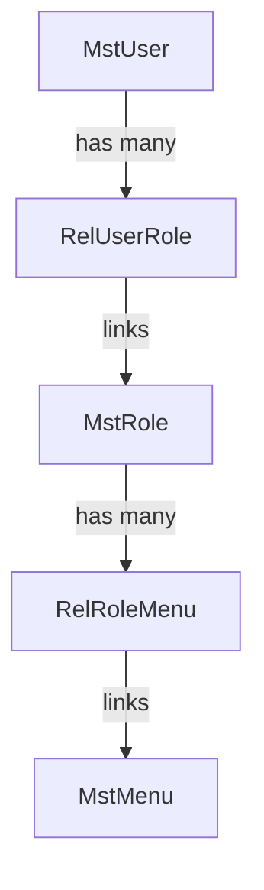

# ZK Framework Spring Boot Template

A clean template for building web applications using **Java**, **Spring Boot**, **ZK Framework**, and **PostgreSQL**.

## 🛠️ Tech Stack

This project leverages the following technologies and versions from [pom.xml](file:///d:/Iseng/zk-template/pom.xml):
- **Core Language**: **Java 21**
- **Framework**: **Spring Boot 3.5.14**
- **UI Architecture**: **ZK Framework 10.0.0-jakarta** (running with **zkspring-core 6.0.0**)
- **Data Persistence**: **Spring Data JPA** with **Hibernate**
- **Database Driver**: **PostgreSQL JDBC 42.2.12**
- **Database Migration**: **Flyway Migration 10.x**
- **Utilities**: **Apache POI (OOXML) 5.4.1** (for Excel spreadsheet processing)
- **Code Optimization**: **Lombok** (annotation library to reduce boilerplate code)
- **Data Validation**: **Spring Boot Validation Starter** (Hibernate Validator)

---

## 🚀 Getting Started

### 1. Clone the Repository
Clone the project repository to your local machine:
```bash
git clone https://github.com/Rey1510/zk-template.git
cd zk-template
```

### 2. Database Configuration & Setup

The application connects to **PostgreSQL**. Configure your credentials in [application.properties](file:///d:/Iseng/zk-template/src/main/resources/application.properties):

```properties
spring.datasource.url=jdbc:postgresql://<host>:<port>/<database>
spring.datasource.username=<username>
spring.datasource.password=<password>
spring.jpa.properties.hibernate.default_schema=zktmp
```

#### DDL Schema Definition
Run the following SQL statements on your PostgreSQL database under the schema `zktmp` (create the schema first with `CREATE SCHEMA zktmp;` if it does not exist) to initialize the tables:

```sql
-- 1. Create Master Tables
CREATE TABLE zktmp.mst_user (
    user_id SERIAL PRIMARY KEY,
    username VARCHAR(50) NOT NULL UNIQUE,
    full_name VARCHAR(100) NOT NULL,
    email VARCHAR(100) NOT NULL,
    password VARCHAR(100) NOT NULL,
    active BOOLEAN DEFAULT TRUE
);

CREATE TABLE zktmp.mst_role (
    role_id SERIAL PRIMARY KEY,
    role_code VARCHAR(30) NOT NULL UNIQUE,
    role_name VARCHAR(100) NOT NULL
);

CREATE TABLE zktmp.mst_menu (
    menu_id SERIAL PRIMARY KEY,
    menu_code VARCHAR(50) NOT NULL UNIQUE,
    menu_name VARCHAR(100) NOT NULL,
    zul_path VARCHAR(200) NOT NULL,
    menu_order INTEGER NOT NULL,
    active BOOLEAN DEFAULT TRUE
);

-- 2. Create Relation Tables
CREATE TABLE zktmp.rel_user_role (
    rel_user_role_id SERIAL PRIMARY KEY,
    user_id INTEGER NOT NULL REFERENCES zktmp.mst_user(user_id) ON DELETE CASCADE,
    role_id INTEGER NOT NULL REFERENCES zktmp.mst_role(role_id) ON DELETE CASCADE
);

CREATE TABLE zktmp.rel_role_menu (
    rel_role_menu_id SERIAL PRIMARY KEY,
    role_id INTEGER NOT NULL REFERENCES zktmp.mst_role(role_id) ON DELETE CASCADE,
    menu_id INTEGER NOT NULL REFERENCES zktmp.mst_menu(menu_id) ON DELETE CASCADE
);

-- 3. Create Feature Table
CREATE TABLE zktmp.report (
    id SERIAL PRIMARY KEY,
    report_name VARCHAR(100) NOT NULL,
    status VARCHAR(20) NOT NULL,
    created_by VARCHAR(50),
    created_date TIMESTAMP,
    updated_by VARCHAR(50),
    updated_date TIMESTAMP
);
```

#### Seed Mock Data
Insert sample roles, menus, users, and relationships to get started:

```sql
-- Insert Roles
INSERT INTO zktmp.mst_role (role_code, role_name) VALUES 
('ADMIN', 'Administrator'),
('MAKER', 'Maker');

-- Insert Menus
INSERT INTO zktmp.mst_menu (menu_code, menu_name, zul_path, menu_order, active) VALUES 
('HOME', 'Home', '/pages/home.zul', 1, TRUE),
('REPORT', 'Report', '/pages/report.zul', 2, TRUE);

-- Insert Users (Passwords are plain text for template demonstration)
INSERT INTO zktmp.mst_user (username, full_name, email, password, active) VALUES 
('admin', 'Administrator', 'admin@example.com', 'admin123', TRUE),
('maker', 'Maker', 'maker@example.com', 'maker123', TRUE);

-- Map Users to Roles (admin gets ADMIN and MAKER roles, maker gets MAKER role)
INSERT INTO zktmp.rel_user_role (user_id, role_id) VALUES 
(1, 1), -- admin -> ADMIN
(1, 2), -- admin -> MAKER
(2, 2); -- maker -> MAKER

-- Map Menus to Roles (ADMIN gets HOME & REPORT, MAKER gets HOME only)
INSERT INTO zktmp.rel_role_menu (role_id, menu_id) VALUES 
(1, 1), -- ADMIN -> HOME
(1, 2), -- ADMIN -> REPORT
(2, 1); -- MAKER -> HOME

-- Insert Initial Reports
INSERT INTO zktmp.report (report_name, status, created_by, created_date) VALUES 
('Quarterly Financial Audit', 'SUCCESS', 'admin', CURRENT_TIMESTAMP),
('Weekly Server Status Logs', 'PENDING', 'admin', CURRENT_TIMESTAMP),
('Customer Transaction Batch', 'FAILED', 'maker', CURRENT_TIMESTAMP);
```

---

## 🔑 Authentication & Navigation Flow

The security mapping and menu rendering model utilizes a **Role-Based Access Control (RBAC)** architecture:



### 1. User Authenticating
- A user signs in using their credentials (e.g. `admin` / `admin123`).
- **`CurrentUserService`** checks the database via **`MstUserRepository`** to verify that the username exists, the password matches (plain-text comparison), and the account is active.

### 2. Role Resolution (Responsibilities)
- Upon successful authentication, **`RelUserRoleRepository`** is queried to find all active roles associated with that user.
- These roles are mapped to **`ResponsibilityDTO`** models and stored inside the session-scoped **`UserSession`** bean.
- The user can switch their active role/responsibility dynamically during the session.

### 3. Dynamic Menu Filtering
- The sidebar or main layout queries **`MenuService`** for the list of available menus.
- **`MenuServiceImpl`** fetches active menus using **`RelRoleMenuRepository`** based on the currently selected role.
- Menus are ordered sequentially using the `menu_order` field.

---

## 🛠️ Build & Run

Ensure you have **Java 21** installed, then run:

```bash
# Compile the project
./mvnw clean compile

# Launch the Spring Boot application
./mvnw spring-boot:run
```
Open **`http://localhost:8080/login.zul`** in your browser.
